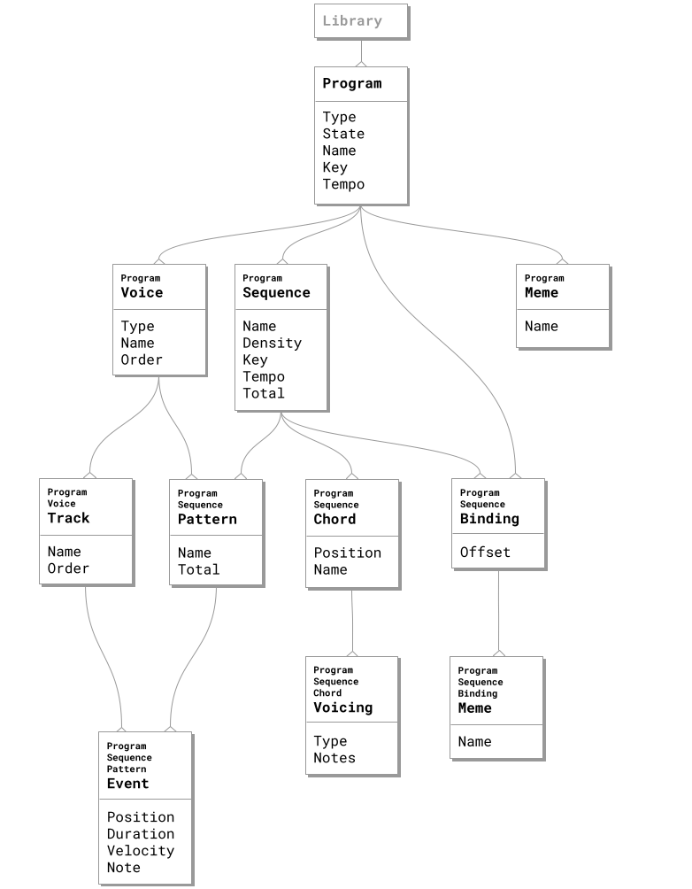
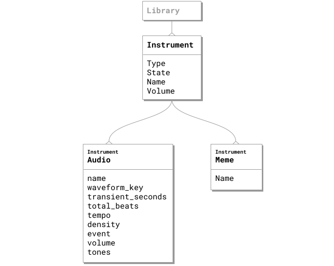
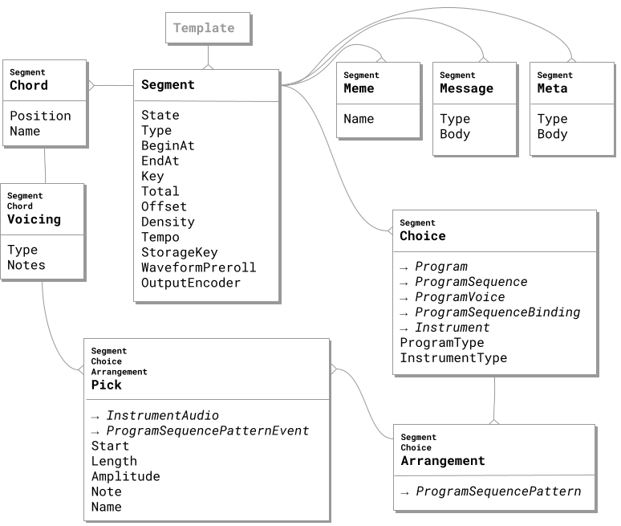

+++
archetype = "chapter"
title = "Appendix B. Entities & their Relationships"
weight = 7
+++

We’ve discussed many entities & their relationships implicitly by showing all these screenshots of XJ music content libraries and describing the function of live music fabrication.

In this section, all entities are explicitly depicted by a series of Entity Relationship (ER) diagrams.

## Program Model

## Instrument Model

## Segment Model

