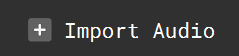

+++
title = "Importing Audio"
+++

Click the **Import Audio** button at the top right above the main Instrument window to open your file explorer and choose an audio file to upload. The fiile types currently supported are **.wav**, **.aiff**, and **.mp3**. Upon importing a new audio file, the user will be taken to the [**audio editor**](/getting-started/Audio%20Editor/_index.md).

