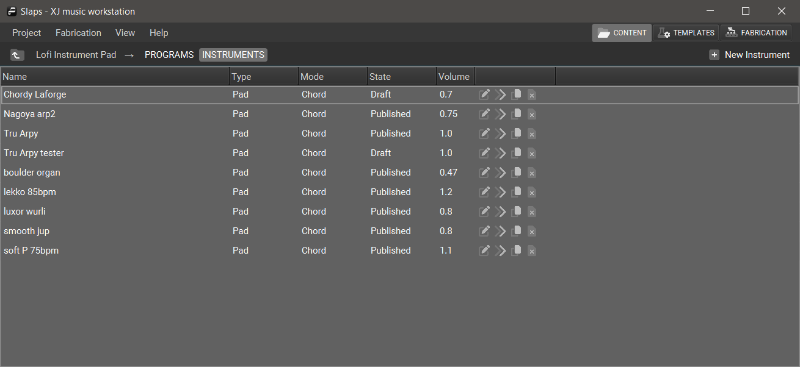

+++
title = "Instruments"
+++

In XJ music, an **Instrument** is a collection of Audios. While all instruments are stored according to the Instrument Model, different Types and Modes of instruments have unique purposes and behaviors.

The instrument menu contains a list of all instruments. Each instrument contains a configuration, which may affect the music when that instrument is chosen.

Here you can see the attributes of each Instrument, as well as the memes assigned to it.

To compose the content of any given instrument,
click its name in the list to open the Instrument Editor.

{}
The buttons on each row can be used
to **Move**, **Edit**, **Duplicate**, or **Destroy** that Instrument.
{}