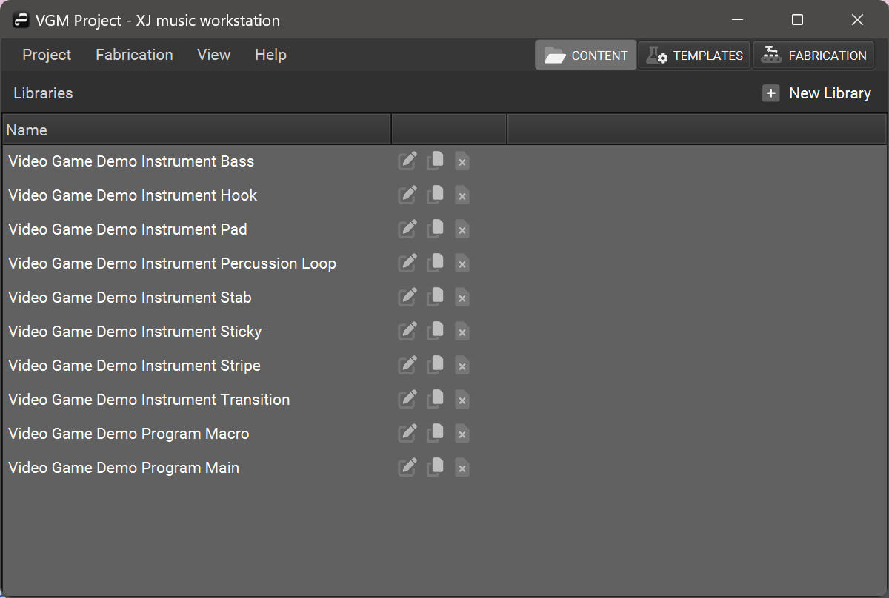

+++
title = "Libraries"
+++

Libraries are collections of content within the XJ workstation.

When you open a Project, you’ll see a list of all its Libraries.

Click on the name of a Library to see the content within.

Libraries contain two types of content: **Programs** and **Instruments**.

{}
The buttons on each row can be used
to Edit, Duplicate, or Destroy that Library.
{}