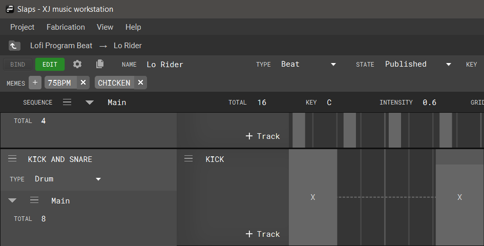

+++
title = "Editing a Beat Program"
+++

Beat programs utilize a grid system to graphically represent time, divided into equal segments and measured in bars. When editing a beat program, users place events on the grid by left-clicking within the timeline. To change the positioning, left-click and drag.

With the snap option enabled, events will be dragged to the nearest grid line during placement and modifying duration.

To extend or shorten the length of the event, bring your cursor to either side of the event, click and drag the edges. Double-clicking on an event brings up its event properties menu, which contains Tones, Velocity, Position, and Duration options.

To delete an event, right-click the event and choose delete.

