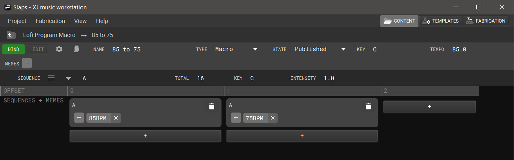

+++
title = "Editing a Macro Program"
+++

Each sequence of a macro program corresponds to a song a.k.a. main program that will be chosen.

The content of a macro program sequence is irrelevant. We only use a sequence to store attributes such as tempo and intensity. For example, this is how tempo is driven. However, we are waiting on some software enhancements such as XJ Tempo Behavior v2 and a more user-friendly editor mode for macro programs.

First, you’ll create some number of sequences containing attribute values for total, key, tempo, and intensity:

Next, you’ll make sure to be in BIND mode (see the upper left corner) and then bind your sequences into some order. The bindings can have unique memes.

