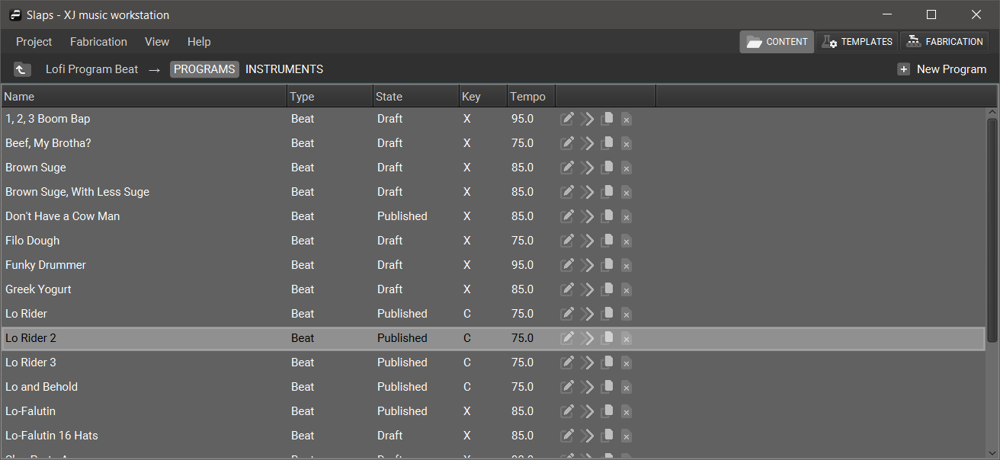

+++
title = "Programs"
+++

In XJ music, a **Program** is a collection of musical instructions. While all programs are stored according to the **Program Model**, different [**Types**](/getting-started/Programs/Types%20of%20Programs/) of programs have unique purposes and behaviors.

Each program contains a **configuration**, which may affect the music when that program is chosen.

The program menu contains a list of all programs.

Here you can see the attributes of each Program, as well as the memes assigned to it.

To compose the content of any given program,
click its name in the list to open the **Program Editor**.