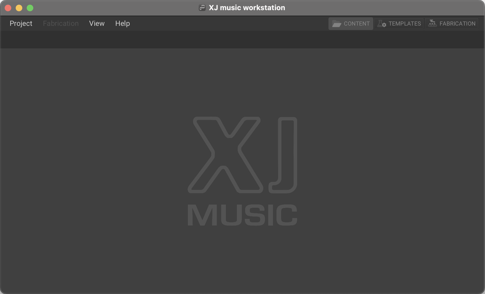
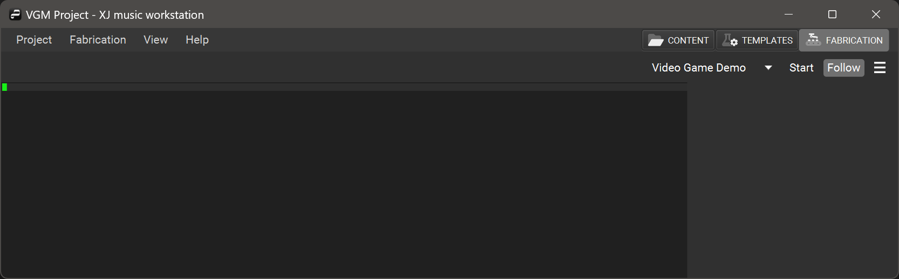
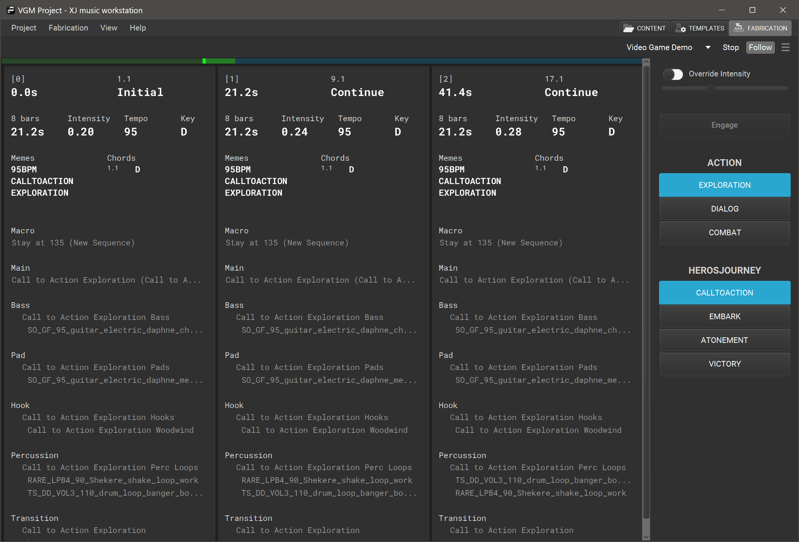

+++
categories = ["Getting-Started"]
archetype = "chapter"
title = "Getting Started"
weight = 4
tags = ["start", "getting started", "intro", "tutorial"]
+++

When you first open the XJ music workstation, you'll see this empty space, because no project is open.

## Project Menu

The [**Project menu**](/getting-started/menu-bar/) provides a comprehensive set of options for managing project files efficiently. Creating new Projects, opening previously created Projects, saving your work, changing directory settings, and quitting the workstation is done here.

## Fabrication Menu

The [**Fabrication menu**](/making-xj-music/fabrication/fabrication-settings/) displays two commands for the fabrication of musical segments, Start (CTRL+Space) and Follow (CTRL+ALT+Space).

## View Menu

The [**View menu**](/getting-started/menu-bar/) contains navigational shortcuts between the Content, Templates, and Fabrication tabs, Log controls, and backward/forward buttons to visit their previously viewed locations.

## Content Tab

In the Content section of the workstation, you will see the [**Content Browser**](/getting-started/content-browser/) which lists
all the the [**Libraries**](/making-xj-music/libraries/) in the current project. Inside of each Library
is a list of [**Programs**](/making-xj-music/programs/) and [**Instruments**](/making-xj-music/instruments/).

Open a program to edit it in the [**Program Editor**](/getting-started/program-editor/)
or open an instrument to edit it in the [**Instrument Editor**](/getting-started/instrument-editor/)

## Templates Tab

In the Templates section of the workstation, you will see a list of available [**Templates**](/making-xj-music/templates/) in the current project. Templates contain bound [**Libraries**](/making-xj-music/libraries/)- your [**Programs**](/making-xj-music/programs/), and [**Instruments**](/making-xj-music/instruments/).

## Fabrication Tab

In the Fabrication section of the workstation, you will see another empty space.

If all Libraries have finished loading their data, you can prompt the workstation using the Start button in the top right-hand side, and you will see the playback Timeline displayed!

