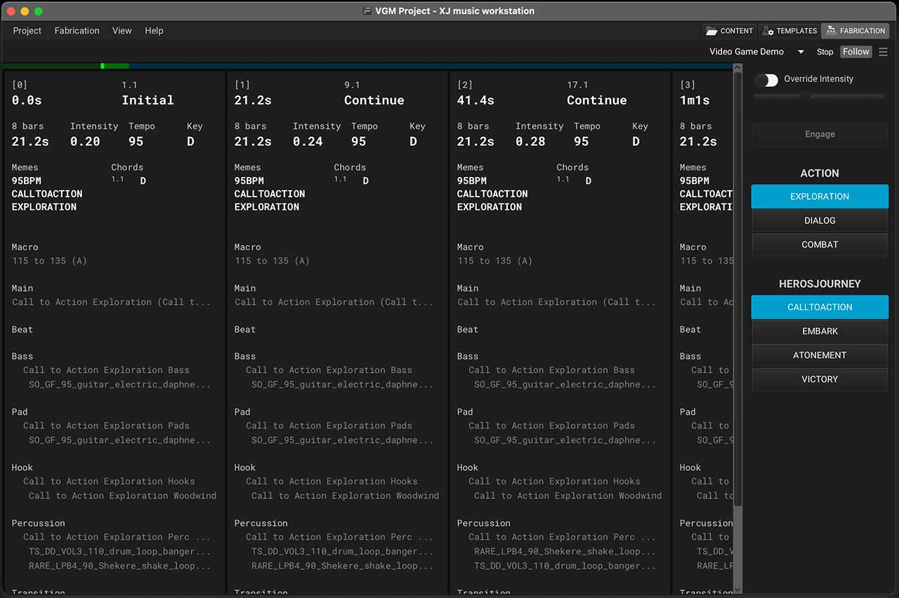

+++
title = "Fabrication Tab"
weight = 50
tags = ["fabrication", "play", "playback"]
+++

In the Fabrication tab is where you can control the playback of your music. The Fabrication timeline is the command center of the XJ music workstation, offering precise control over your compositions.

There are a number of [**Fabrication Settings**](/making-xj-music/fabrication/fabrication-settings) that can be modified to change the timeline behavior and audio output.
