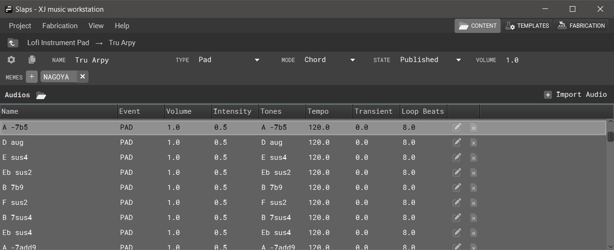
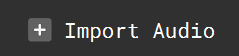
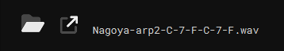
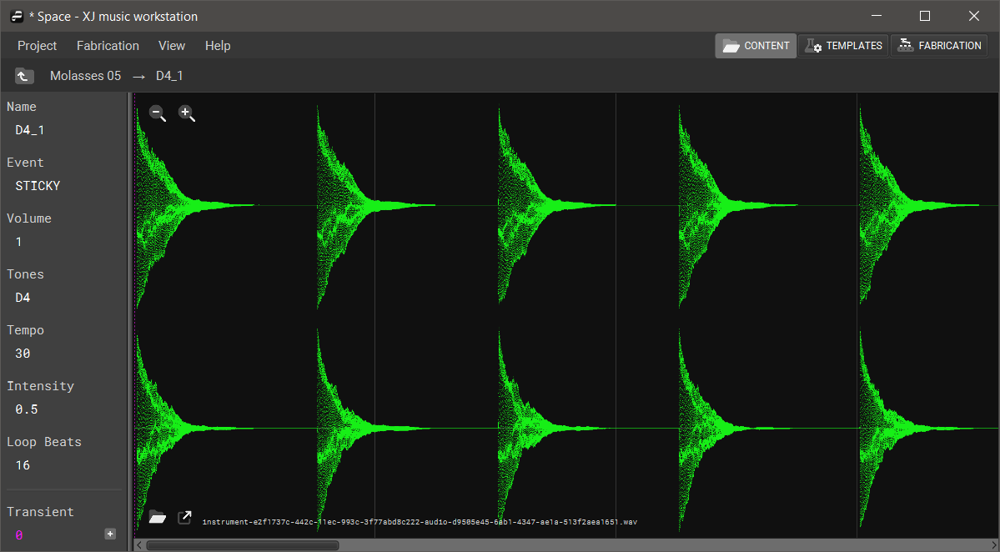

+++
categories = ["Getting-Started"]
title = "Instrument Editor"
weight = 40
tags = ["upload", "import", "audio", "stems", "sounds"]
+++

In XJ music, an instrument comprises a set of Instrument Audios. This section covers the importation of audio stems and the corresponding properties for uploaded audio.

## Importing Audio

Click the **Import Audio** button at the top right above the main Instrument window to open your file explorer and choose an audio file to upload. The fiile types currently supported are **.wav**, **.aiff**, and **.mp3**. Upon importing a new audio file, the user will be taken to the [**audio editor**](/getting-started/instrument-editor/#audio-editor/).

## Audio Editor

### Audio Properties

The properties of the selected audio are listed in the side panel to the left of the waveform viewer and display the name, event, volume, tones, tempo, intensity level, and loop beats length. Underneath the main audio properties panel is a highlighted section containing the numeric value for the transient offset.

### Open Audio Folder and Open Audio File

The two icons in the bottom left of the Waveform Viewer will open the selected audio's folder and open the selected audio file, respectively. The audio's original filename is displayed to the right of the open selected audio icon.

### Setting a Transient Offset

A transient offset is a floating integer that determines in measurements of seconds where the chosen audio will be starting from when its event is slated to trigger. The default transient offset is 0.0, indicating that the audio will start playing at the beginning of its file when triggered. A transient offset of 0.5 will include a pre-roll of 0.5 seconds and begin playing there. To set a transient offset, click the + symbol and place the new offset on the waveform in its window. You can also manuially enter the exact time in the Transient text field.

### Waveform Viewer

The waveform viewer component gives the user a graphical representation of the amplitude of selected audio over time, allowing the user to pinpoint peaks and valleys, monitor levels, and synchronize timing.

Use the magnifying glass icons at the top left of the waveform viewer to zoom in and out.

