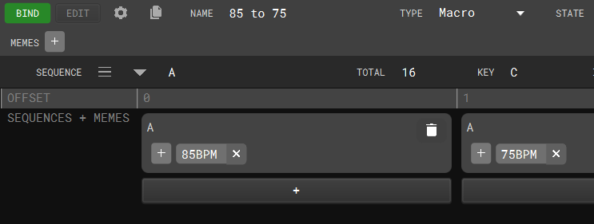
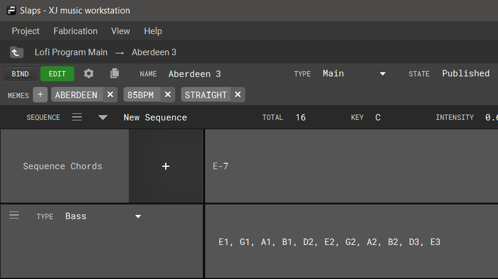
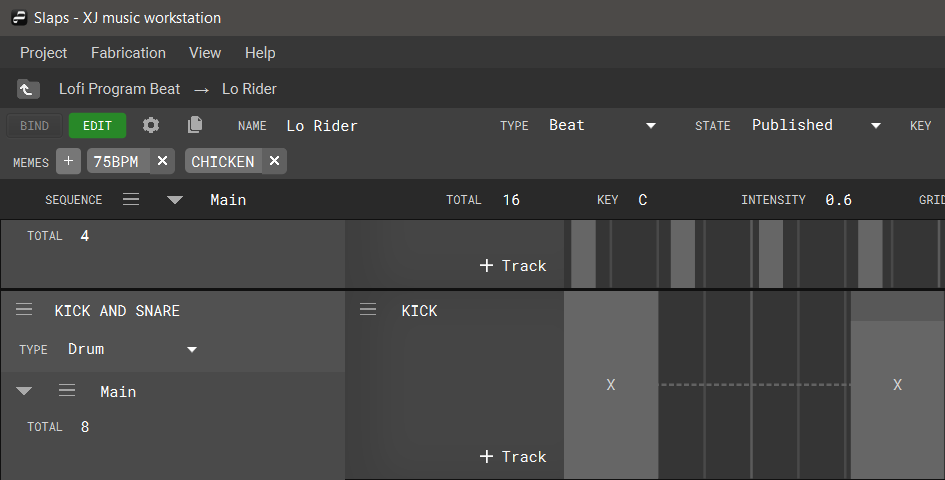
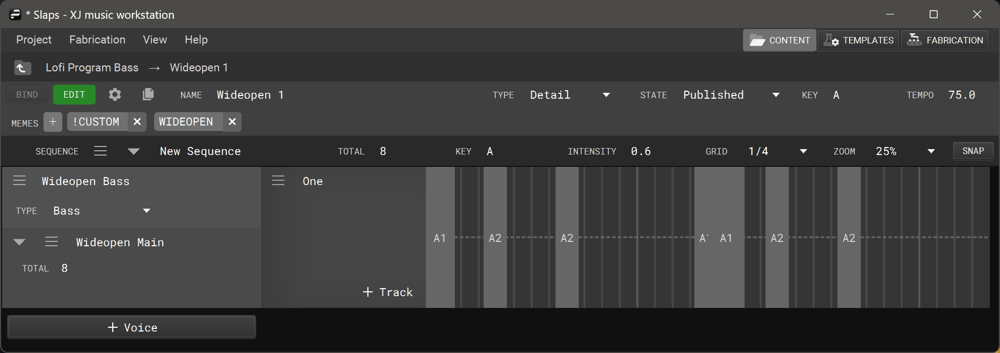

+++
categories = ["Getting-Started"]
title = "Program Editor"
weight = 30
tags = ["Program", "program editor", "segment", "macro", "main", "beat", "detail"]
+++

The Program Editor allows you to edit music notation by placing Events within Patterns.

There are different modes of editing available. The editor will automatically show the panels corresponding to the type of program you are currently editing: Macro Program, Main Program, Beat Program, or Detail Program.

[**Editing a Macro Program**](#editing-a-macro-program)

[**Editing a Main Program**](#editing-a-main-program)

[**Editing a Beat Program**](#editing-a-beat-program)

[**Editing a Detail Program**](#editing-a-detail-program)

## Editing a Macro Program

Each sequence of a macro program corresponds to a song a.k.a. main program that will be chosen.

The content of a macro program sequence is irrelevant. We only use a sequence to store attributes such as tempo and intensity. For example, this is how tempo is driven. However, we are waiting on some software enhancements such as XJ Tempo Behavior v2 and a more user-friendly editor mode for macro programs.

First, you’ll create some number of sequences containing attribute values for total, key, tempo, and intensity:

Next, you’ll make sure to be in **BIND** mode (see the upper left corner) and then bind your sequences into some order. The bindings can have unique memes.

## Editing a Main Program

Main Programs contain musical notation describing chord progressions and voicings of those chords for various types of instruments. XJ will look for the chord progression/voicing combinations when the main program has been bound to a template and chosen during playback.

## Editing a Beat Program

Beat programs utilize a grid system to graphically represent time, divided into equal segments and measured in bars. When editing a beat program, users place events on the grid by left-clicking within the timeline. To change the positioning, left-click and drag.

With the snap option enabled, events will be dragged to the nearest grid line during placement and modifying duration.

To extend or shorten the length of the event, bring your cursor to either side of the event, click and drag the edges. Double-clicking on an event brings up its event properties menu, which contains Tones, Velocity, Position, and Duration options.

To delete an event, right-click the event and choose delete.

## Editing a Detail Program

Detail programs utilize the same grid as Beat Programs, but to coordinate the position, duration, velocity, and notation of melodic events.

