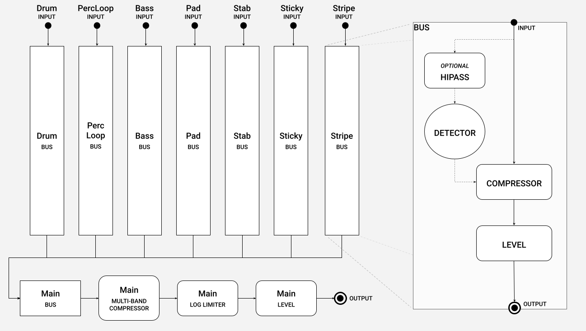
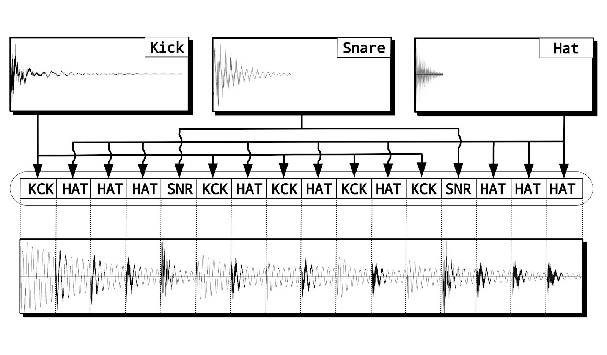
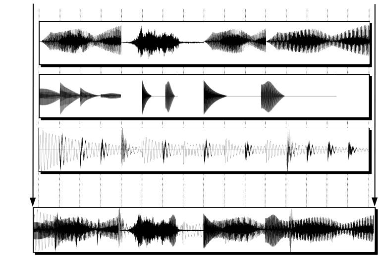
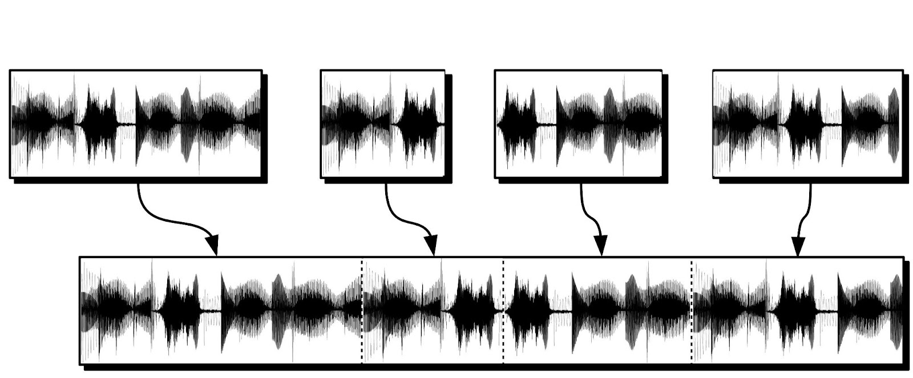

+++
title = "Dubbing of Output Audio"
+++

We are still working with the original simple XJ audio mixer, to combine all source audio into the final output audio. Following is the design for our v0.7 Mixer.

[Bring in the diagrams from the patent in order to illustrate how audio makes its way from instruments, through choice, arrangement, and picking, then finally to dub]: #

1. Mix each Layer from arranged Instrument Audio sources

2. Mix Layers into Segment

3. Add Segments for Streaming

