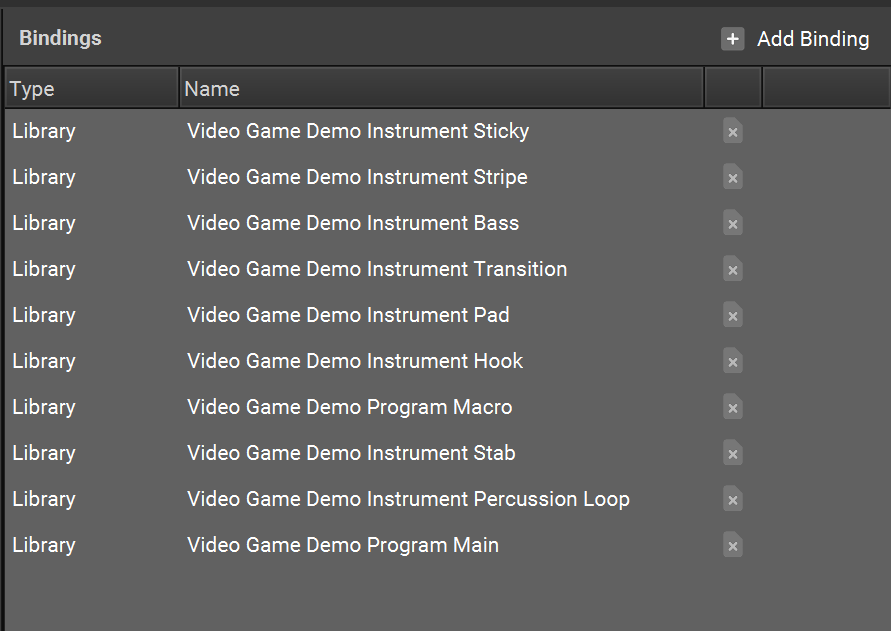

+++
title = "Binding Template Content"
+++

The Bindings menu allows you to specify which Library, Program, or Instrument can be utilized in a Template. When creating a Template it is important to Bind all of the necessary Libraries, including Main and Macro Programs, Beat Programs, Detail Programs, and Instruments.

