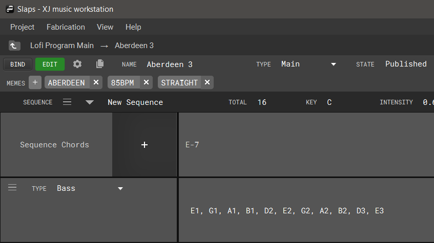

+++
title = "Editing a Main Program"
+++

Main Programs contain musical notation describing chord progressions and voicings of those chords for various types of instruments. XJ will look for the chord progression/voicing combinations when the main program has been bound to a template and chosen during playback.

