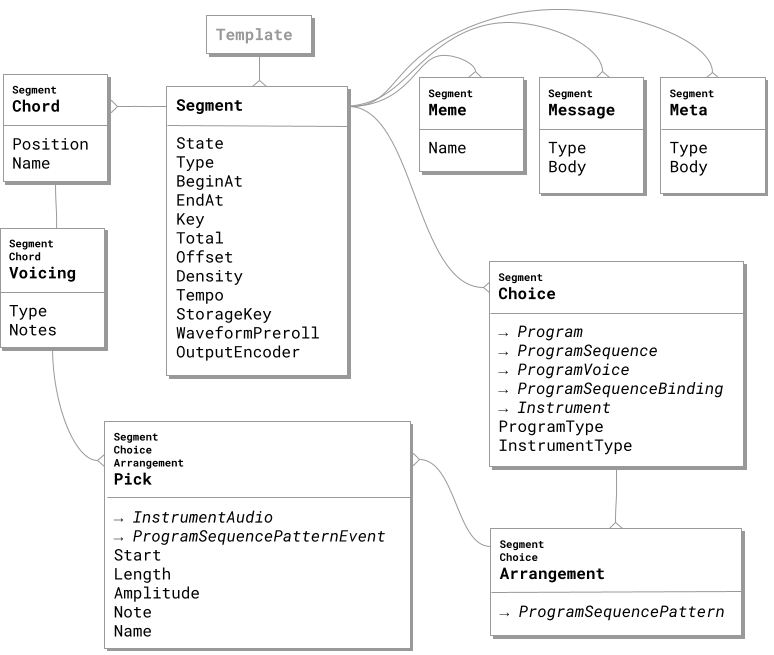

+++
title = "Fabrication"
description = "XJ music fabrication is the command center of the XJ music workstation, offering precise control over playback of your compositions."
weight = 8
tags = ["fabrication", "timeline", "composition", "segment", "chain", "real-time", "recording"]
+++

XJ music fabrication is the command center of the XJ music workstation, offering precise control over playback of your compositions.

## Segment Model

During fabrication, XJ constructs a Chain made of a series of **Segments**. Each Segment is a self-contained unit of music that can be played back in real-time or recorded to a file. Segments can be combined to create more complex compositions.

## Fabrication Details

{}

