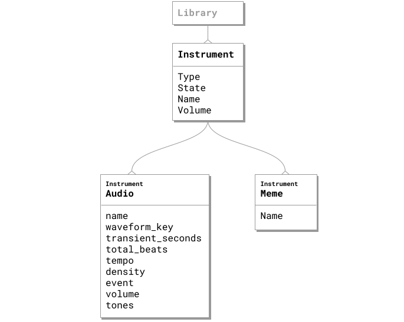

+++
categories = ["XJ-music-Design-and-Theory"]
title = "Instruments"
weight = 3
tags = ["instrument", "audio", "audios", "instrument model", "instrument types", "instrument modes", "instrument details"]
+++

In XJ music, an **Instrument** is a collection of Audios. While all instruments are stored according to the Instrument Model, different Types and Modes of instruments have unique purposes and behaviors.

## Instrument Details

{}
