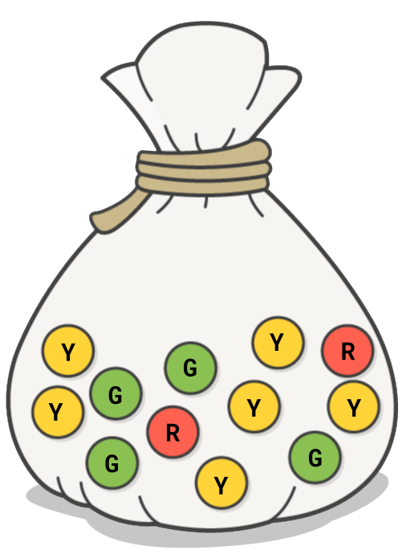

+++
title = "Memes Influence Choice"
+++


A **meme** is a tag that artists apply to programs and instruments in order to guide the choices that XJ makes.

XJ factors in the memes it sees in order to make choices about which programs and instruments will be included in a Segment.


## Pick a Marble from the Bag

In order to make random choices based on weighted options,
XJ uses a stochastic[2] mechanism called a Marble Bag.




The example figure to the left represents a choice between three possible outcomes: Red (R), Green (G), and Yellow (Y). The likelihood of a choice is increased when we add more of that choice’s marbles to the bag.


In the following section, we’ll discuss how the presence of different kinds of memes either increases or decreases the chance of a selection, or prevents a particular option from being chosen at all. These are in fact expressed by adding and removing marbles from a virtual bag.


For example, to make sure an option is never chosen,
we remove all of its marbles from the bag.


detail the process of how we add memes to the segment as we choose content

XJ’s marble bag is actually divided into phases. When a marble is put into the bag, it is assigned a phase.  For example, if the phase 1 bag contains any marbles, we will pick from only the phase 1 bag and skip phases 2 and beyond. This supports functionality such as “XJ always chooses a directly-bound program or instrument when available”  

| Meme Type                 | Example    | When meme matches                                                                                                                                                                                                                                |
|---------------------------|------------|--------------------------------------------------------------------------------------------------------------------------------------------------------------------------------------------------------------------------------------------------|
| Regular Meme              | `PEACHES`  | Increase likelihood to choose content that matches regular memes XJ has already chosen for the segment.                                                                                                                                          |
| Anti-Meme aka Not-Meme    | `!PEACHES` | Do not choose this content, if we have already chosen content with the corresponding regular meme.  If XJ has already chosen content for the segment having anti-meme !PEACHES, then XJ will not choose content having regular meme PEACHES      |
| Unique-Meme aka Solo-Meme | `$PEACHES` | Do not choose this content, if we have already chosen content with this unique-meme. If XJ has already chosen content for the segment having unique-meme $PEACHES, then XJ will not choose any other content having this same unique-meme.       |
| Number-Meme               | `5PEACHES` | Do not choose this content, if we have already chosen content with a different number of the same meme. If XJ has already chosen content for the segment having number-meme 5PEACHES, then XJ will not choose content with number-meme 7PEACHES. |
| Strong-Meme               | `PEACHES!` | Only choose content if we have already chosen content with the corresponding regular meme.   Only if XJ has already chosen content for the segment having regular meme PEACHES will XJ consider choosing content with strong meme PEACHES!       |

\* Strong memes are not added to the stack.

## Meme Taxonomy

A template configuration has a field called ```memeTaxonomy``` which defines the taxonomy of memes.

For example, this might look like


```
memeTaxonomy = [

  {"memes":["RED","GREEN","BLUE"],"name":"COLOR"},

  {"memes":["WINTER","SPRING","SUMMER","FALL"],"name":"SEASON"}

]
```

That would tell XJ about the existence of a meme category called ```COLOR``` with values ```RED```, ```GREEN```, and ```BLUE```, and a meme category called ```SEASON``` with values ```WINTER```,  ```SPRING```, ```SUMMER```, and ```FALL```.

For example, after content having ```RED``` is chosen, we can choose nothing with ```GREEN``` or ```BLUE```.

*NOTE: Use a semicolon to separate the categories. Each category has a comma-separated list of memes.
