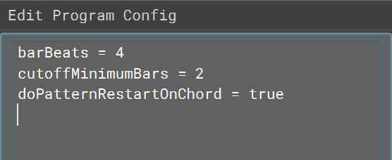

+++
title = "Configuration of Programs"
tags = ["program", "configuration", "settings", "parameters"]
+++

| Type                 | Purpose                                                                                               |
|----------------------|-------------------------------------------------------------------------------------------------------|
| barBeats             | Sets the length of a bar, as measured in total number of beats.                                        |
| cutoffMinimumBars    | Sets the minimum length of bars that a sequence can transition into another in.                         |
| doPatternRestartOnChord | Determines whether patterns restart on chord changes.                                                 |
