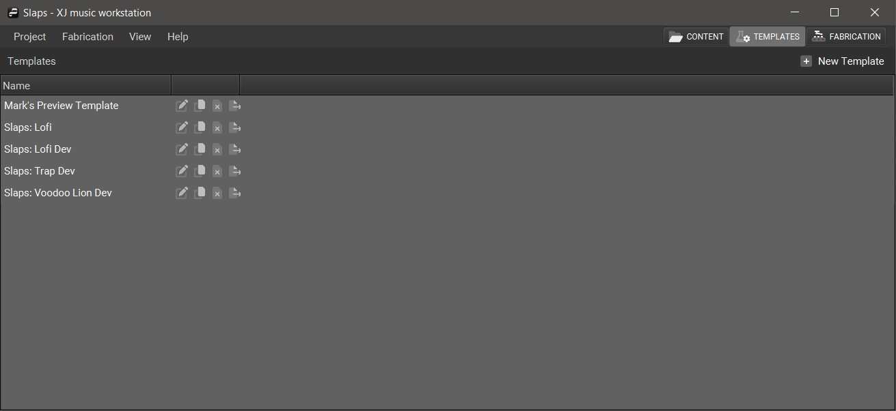

+++
categories = ["XJ-music-Design-and-Theory"]
title = "Templates"
tags = ["Music", "Templates"]
+++

Templates are packaged compilations of Libraries, potentially highlighting specific Instruments and Programs that can be previewed and/or broadcast.

Each template contains a **configuration**, which may affect the music when fabricating that template.

Click on the name of a Template to edit that template.

{}
The buttons on each row can be used
to **Edit**, **Duplicate**, or **Destroy** that Template.
{}

{}
