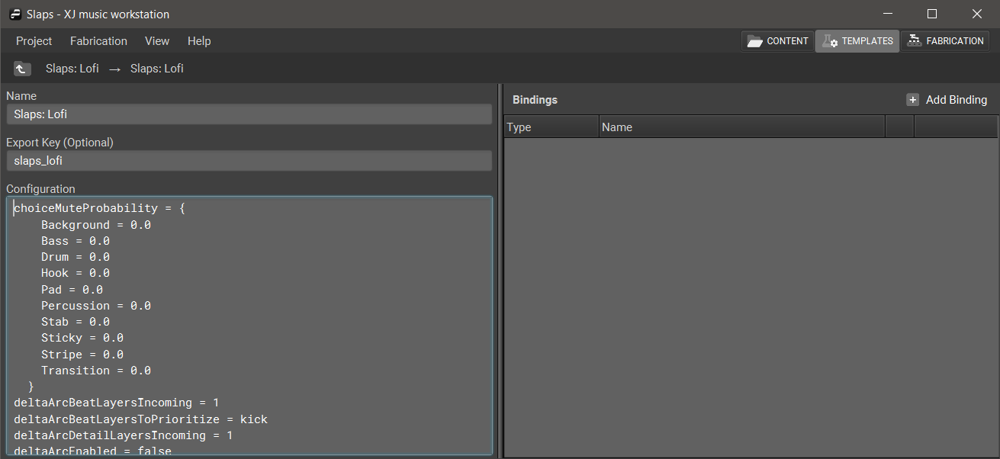

+++
categories = ["XJ-music-Design-and-Theory"]
title = "Configuration of Templates"
tags = ["template", "configuration", "settings", "parameters"]
+++

Each Template contains a Template Configuration, a set of values and definitions artists provide to XJ in addition to their chosen Bindings.

The Template Configuration menu is accessed by clicking the gear icon in the middle of the Template header.

| Template Configuration Values | Description                                                                                   |
|-------------------------------|-----------------------------------------------------------------------------------------------|
| **backgroundLayerMax/backgroundLayerMin** | The maximum and minimum number of background Ambience Loop events selected                    |
| **bufferAheadSeconds/bufferBeforeSeconds** | The amount of seconds that the Template will buffer ahead and before*                        |
| **choiceMuteProbabilityInstrumentType** | The chance that the Instrument type will be randomly muted in a sequence, from 0.0-1.0 (0% to 100%) |
| **deltaArcBeatLayersIncoming**    | The number of Beat Layers being input into the Delta Arc function                              |
| **deltaArcBeatLayersToPrioritize** | The Events in the Sequence to be prioritized in the Delta Arc function                         |
| **deltaArcDetailLayersIncoming**  | The number of Detail Layers being input into the Delta Arc function                            |
| **deltaArcEnabled**               | Enables or disables the Delta Arc function                                                   |
| **densityCeiling/densityFloor**   | The upper and lower limits of Sequence Density (0.0-1.0)                                       |
| **detailLayerOrder**              | The order in which Instrument types are prioritized                                           |
| **dubMasterVolumeInstrumentType** | The master volume of an Instrument type                                                       |
| **eventNamesLarge/eventNamesMedium/eventNamesSmall** | Defines the naming convention for Event sizes                                         |
| **instrumentTypesForAudioLengthFinalization** | Determines which Instrument types are muted when another instance of itself plays or the sequence ends |
| **instrumentTypesForInversionSeeking** | Determines which Instrument types are able to have their chords inverted                   |
| **mainProgramLengthMaxDelta**     | Sets the length of Main Program as they relate to Delta Arcs                                   |
| **memeTaxonomy**                  | The words or phrases XJ will define as Memes (Meme) and the categories that Memes fall into (Category) |
| **mixerHighpassThresholdHz/mixerLowpassThresholdHz** | The upper and lower thresholds for the High Pass and Low Pass EQs                           |
| **outputChannels**                | The number of output channels                                                                 |
| **outputContainer**               | Defines the output container used, e.g ‘OGG’                                                   |
| **outputFrameRate**               | The output frame rate                                                                         |
| **outputSampleBits**              | The output bit-depth                                                                          |
| **percLoopLayerMax/percLoopLayerMin** | The maximum or minimum amount of Percussion Loop Layers that will play in the Chain           |
| **stickyBunEnabled**              | Enables or disables the Sticky Buns function                                                  |
| **transitionLayerMax/transitionLayerMin** | The maximum or minimum amount of Transition Layers that will play in the Chain              |
| **vmResourceLimitCpu**            | * it isn’t recommended that users make changes to this setting.                               |
| **vmResourceLimitMemoryGb**       | * it isn’t recommended that users make changes to this setting.                               |
| **vmResourceRequestCpu**          | * it isn’t recommended that users make changes to this setting.                               |
| **vmResourceRequestMemoryGb**     | * it isn’t recommended that users make changes to this setting.                               |
